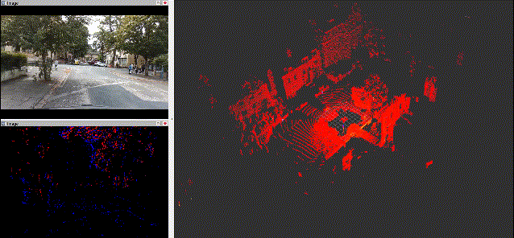

# [CardiffNav]

## Overview

[TODO]

## Objective of the Dataset

[TODO]

## Dataset

### Sensor Setups

| Sensor                  | Specifications                                                                 |
| :---------------------- | :----------------------------------------------------------------------------- |
| **128-line 3D LiDAR**   | (Ouster OS0-128): Horizontal: 360°, Vertical: 90° (+45° to -45°), Resolution: 1024*10Hz |
| **RGB/Stereo Camera**   | (Realsense D435i): RGB: 1280*720, Stereo: 848*480, 30Hz                        |
| **Event Camera**        | (Inivation Davis 346): 346*260                                                 |
| **IMU**                 | (Microstrain 3DM-GX5-AHRS): 9-axis (accelerometer/gyroscope/magnetometer), 500Hz |
| **GNSS receivers**      | (u-blox EVK-F9P): L1/L2 GPS/GLONASS/Galileo/BeiDou, 1Hz                         |
| **GNSS-RTK/INS**        | (NovAtel SPAN-CPT7): Ground truth, RMSE: 5cm, 1Hz                               |

### Extrinsic and Intrinsic Parameters

### General Topics & its Message Type

| Topic                                    | Message Type                         | ROS Topic                                                                 |
| :--------------------------------------- | :----------------------------------- | :------------------------------------------------------------------------ |
| **3D LiDAR point clouds**                | `sensor_msgs/PointCloud2`            | `/ouster/points`                                                          |
| **Stereo Camera Images**                 | `sensor_msgs/Image`                  | `/camera/infra1/image_rect_raw` (left), `/camera/infra2/image_rect_raw` (right) |
| **RGB Camera Images**                    | `sensor_msgs/Image`                  | `/camera/color/image_raw`                                                 |
| **Event Camera Events**                  | `dvs_msgs/EventArray`                | `/dvs/events`                                                             |
| **9-axis IMU**                           | `sensor_msgs/Imu`                    | `/imu/data`                                                               |
| **GNSS Receiver**                        |                                      |                                                                           |
| &nbsp;&nbsp;&nbsp;GNSS raw measurement      | `gnss_comm/GnssMeasMsg`              | `/ublox_driver/range_meas`                                                |
| &nbsp;&nbsp;&nbsp;GPS/Galileo/Beidou Ephem  | `gnss_comm/GnssEphemMsg`             | `/ublox_driver/ephem`                                                     |
| &nbsp;&nbsp;&nbsp;GLONASS Ephem             | `gnss_comm/GnssGloEphemMsg`          | `/ublox_driver/glo_ephem`                                                 |
| &nbsp;&nbsp;&nbsp;GNSS broadcast ionospheric parameters | `gnss_comm/StampedFloat64Array`    | `/ublox_driver/iono_params`                                               |
| &nbsp;&nbsp;&nbsp;GNSS timing message     | `gnss_comm/GnssTimePulseInfoMsg`     | `/ublox_driver/time_pulse_info`                                           |
| &nbsp;&nbsp;&nbsp;u-Blox solution         | `sensor_msgs/NavSatFix`              | `/ublox_driver/receiver_lla`                                              |
| **Ground Truth**                         | `novatel_oem7_msgs/INSPVAX`          | `/novatel/oem7/inspvax`                                                   |

## DataSets

The following table summarizes the characteristics of each sequence in our dataset:

| Name         | Size       | Duration | Distance | Average Velocity | Maximum Velocity |
| :----------- | :--------- | :------- | :------- | :--------------- | :--------------- |
| Cardiff-Seq1 | 101.2 GB   | 627s     | 2.28 Km  | 24.6 Km/h        | 36.3 Km/h        |
| Cardiff-Seq2 | 157.3 GB   | 982s     | 4.64 Km  | 28.0 Km/h        | 74.7 Km/h        |
| Cardiff-Seq3 | 74.2 GB    | 466s     | 1.12 Km  | 20.6 Km/h        | 35.5 Km/h        |
| Cardiff-Seq4 | 25.7 GB    | 159s     | 2.64 Km  | 62.3 Km/h        | 80.1 Km/h        |
| Cardiff-Seq5 | 47.8 GB    | 296s     | 4.07 Km  | 53.1 Km/h        | 76.1 Km/h        |

### Cardiff-Seq1

[TODO]

### Cardiff-Seq2

[TODO]

### Cardiff-Seq3

[TODO]

### Cardiff-Seq4

[TODO]

### Cardiff-Seq5

[TODO]

