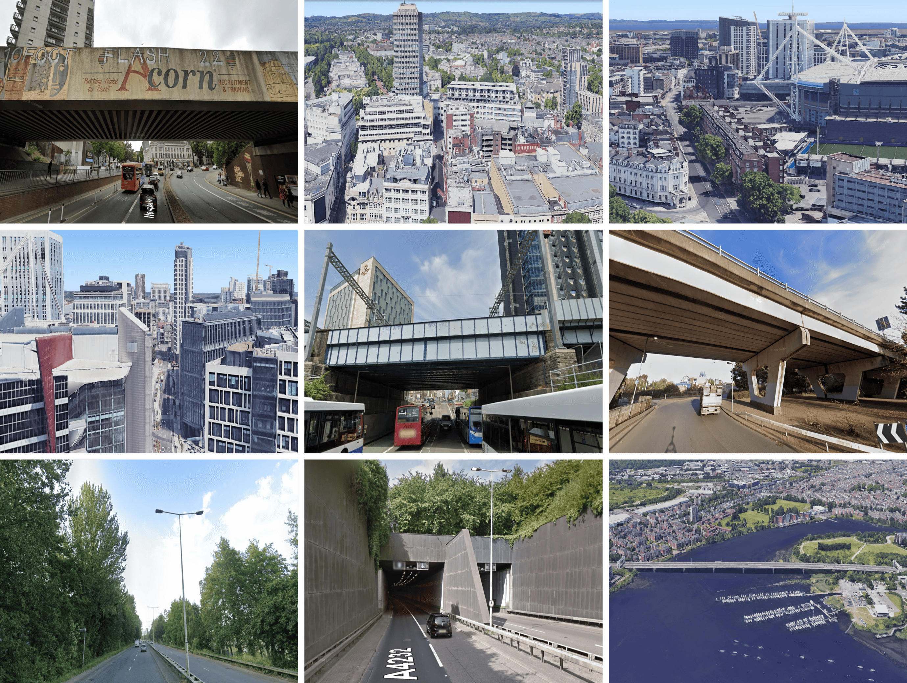
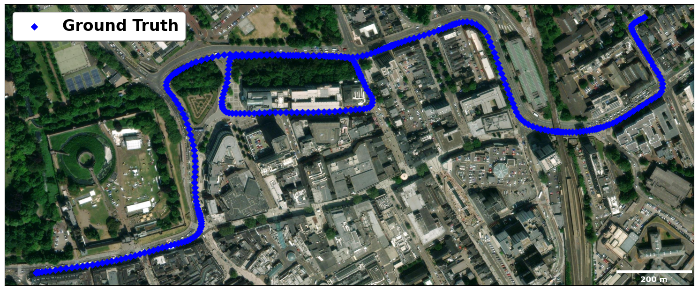
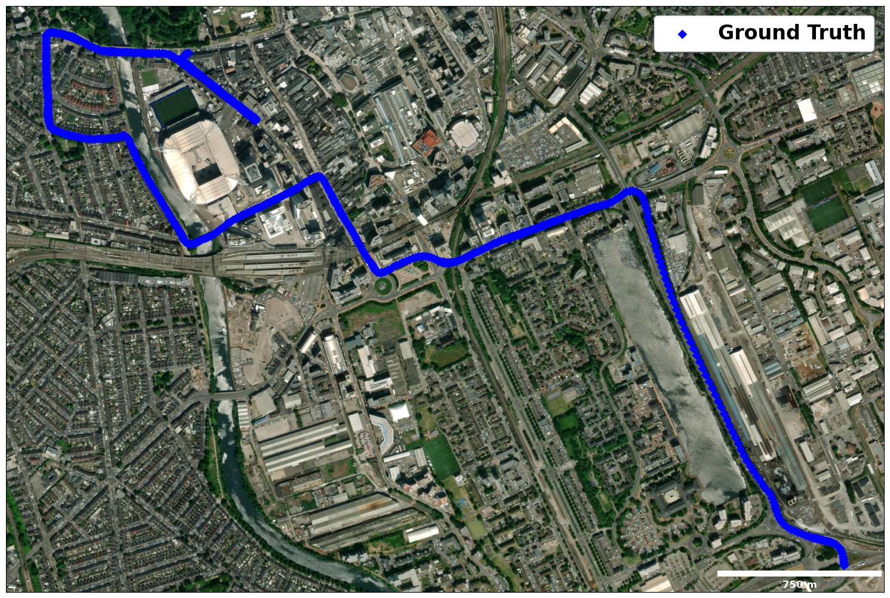
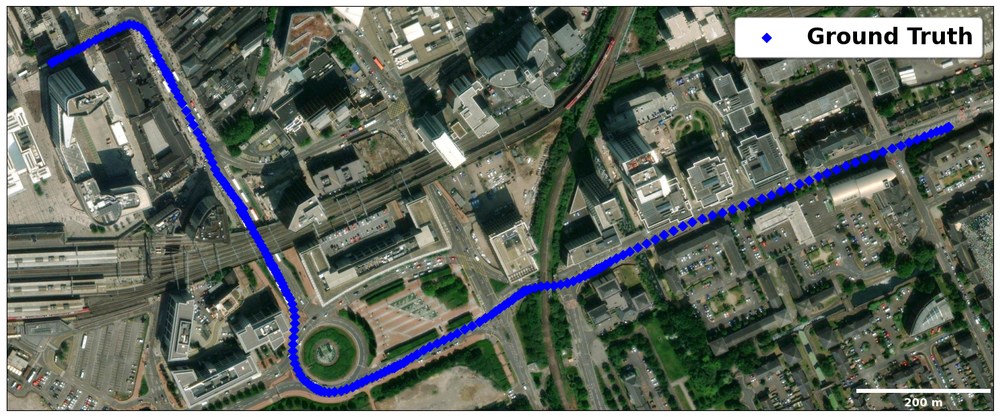
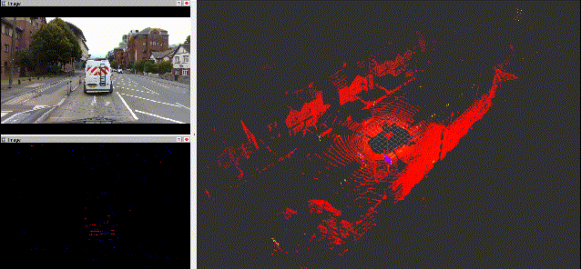
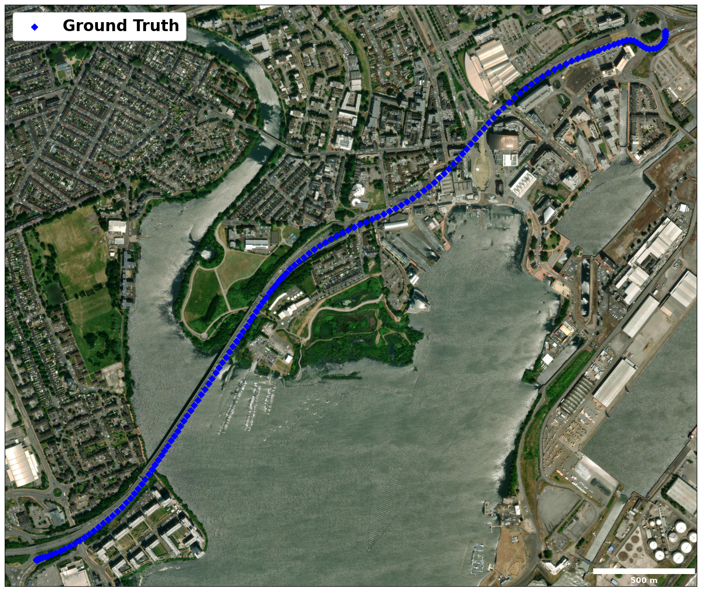
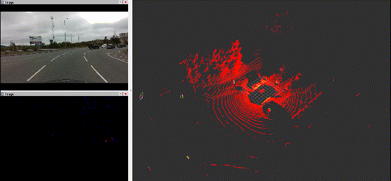
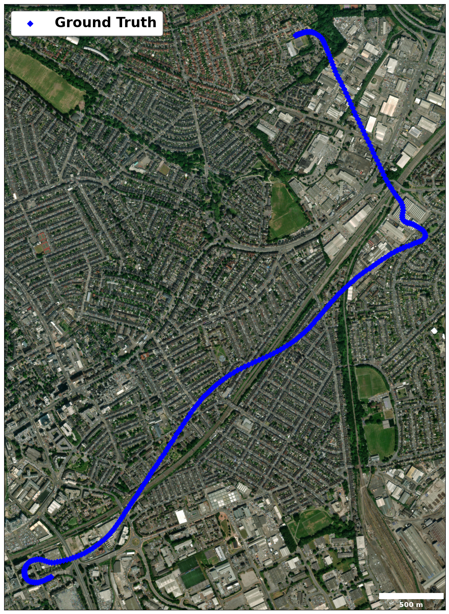
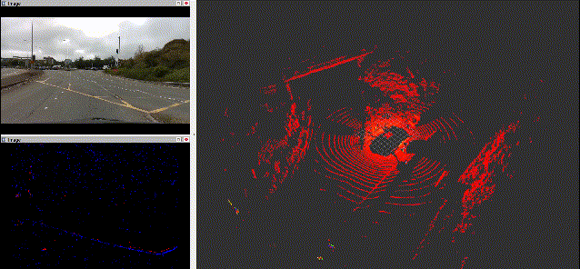

# CardiffNav: A GNSS-centric Multi-modal Dataset for Robust Localisation in Diverse and Challenging Environments

  

## Overview

CardiffNav is a large-scale, multi-modal sensor dataset with a strong emphasis on Global Navigation Satellite System (GNSS) for robust localisation research in diverse and challenging urban environments. It was created to address critical gaps in existing public datasets, particularly the lack of high-fidelity, raw GNSS data and scenarios that capture the full spectrum of real-world signal degradation.

Our dataset features:
- **A State-of-the-Art Sensor Suite:** Including a 128-line high-resolution LiDAR, a full suite of cameras (RGB, stereo, and event), and a 9-axis IMU.
- **Unique High-Fidelity GNSS Data:** CardiffNav is the first public dataset to provide both raw, multi-constellation, multi-frequency GNSS observables and live-sky raw Intermediate Frequency (IF) signal samples.
- **Comprehensive and Challenging Scenarios:** Our five sequences cover a full gradient of environments, from open-sky and highways to deep urban canyons and tunnels, with a key focus on capturing the continuous transitions between them.

This repository contains the dataset sequences, calibration files, and tools to help you get started.

## Objective of the Dataset

The primary objective of CardiffNav is to accelerate the development and validation of the next generation of robust localisation algorithms. Existing datasets often fall short in two key areas:

1.  **Lack of Raw GNSS Data and High Resolution LiDAR:** Most datasets provide only post-processed GNSS solutions (PVT), which prevents research into tightly-coupled fusion algorithms that operate at the raw measurement level. Furthermore, many datasets utilize low-resolution LiDARs (e.g., 16-line), whose sparse point clouds are insufficient for high-fidelity 3D mapping. This makes it impossible to develop and test novel methods that rely on detailed environmental models to predict signal obstruction or for robust feature matching in challenging areas.
2.  **Insufficient Scenario Coverage:** Datasets often lack a continuous spectrum of GNSS signal quality. The transitions between good and bad signal environments are critical for testing a filter's robustness, fault detection, and re-acquisition capabilities.

CardiffNav is designed to directly address these deficiencies by providing the high-fidelity data and challenging, continuous scenarios needed to push the boundaries of robust multi-sensor localisation.

## Paper and Citation

If you use the CardiffNav dataset in your research, please cite our paper:

TODO

## Dataset

### Sensor Setups

| Sensor                  | Specifications                                                                 |
| :---------------------- | :----------------------------------------------------------------------------- |
| **128-line 3D LiDAR**   | Ouster OS0-128: Horizontal: 360°, Vertical: 90° (+45° to -45°), Resolution: 1024x128 @ 10Hz |
| **RGB/Stereo Camera**   | Intel RealSense D435i: RGB: 1280x720, Stereo: 848x480 @ 30Hz                        |
| **Event Camera**        | Inivation Davis 346: 346x260, Asynchronous                                                 |
| **IMU**                 | Microstrain 3DM-GX5-AHRS: 9-axis (accelerometer/gyroscope/magnetometer) @ 500Hz |
| **GNSS Receiver**       | u-blox EVK-F9P: L1/L2 GPS/GLONASS/Galileo/BeiDou @ 1Hz                         |
| **Ground Truth**        | NovAtel SPAN-CPT7: Tightly-coupled RTK/INS, RMSE: <5cm @ 1Hz                               |

### Extrinsic and Intrinsic Parameters
- [Sensor Extrinsic](Sensor_Parameters/sensors_extrinsic.txt)
- [IMU parameters](Sensor_Parameters/gx5_imu_param.yaml)
- [Camera Intrinsics](Sensor_Parameters/camera_Intrinsics.yaml)

### General Topics & its Message Type

| Topic                                    | ROS Topic                          | Message Type                                                                |
| :--------------------------------------- | :----------------------------------- | :------------------------------------------------------------------------ |
| **3D LiDAR Point Clouds**                | `/ouster/points`            | `sensor_msgs/PointCloud2`                                                         |
| **Stereo Camera Images**                 | `/camera/infra1/image_rect_raw` (left), `/camera/infra2/image_rect_raw` (right)                  | `sensor_msgs/Image`|
| **RGB Camera Images**                    | `/camera/color/image_raw`                  | `sensor_msgs/Image`                                                |
| **Event Camera Events**                  | `/dvs/events`                | `dvs_msgs/EventArray`                                                            |
| **9-axis IMU**                           | `/imu/data`                    | `sensor_msgs/Imu`                                                              |
| **GNSS Receiver**                        |                                      |                                                                           |
| &nbsp;&nbsp;&nbsp;Raw Measurements      | `/ublox_driver/range_meas`              | `gnss_comm/GnssMeasMsg`                                               |
| &nbsp;&nbsp;&nbsp;Ephemeris (GPS/Galileo/BeiDou)  | `/ublox_driver/ephem`             | `gnss_comm/GnssEphemMsg`                                                   |
| &nbsp;&nbsp;&nbsp;Ephemeris (GLONASS)     | `/ublox_driver/glo_ephem`          | `gnss_comm/GnssGloEphemMsg`                                                |
| &nbsp;&nbsp;&nbsp;Iono. Parameters       | `/ublox_driver/iono_params`    | `gnss_comm/StampedFloat64Array`                                              |
| &nbsp;&nbsp;&nbsp;Timing Message         | `/ublox_driver/time_pulse_info`     | `gnss_comm/GnssTimePulseInfoMsg`                                          |
| &nbsp;&nbsp;&nbsp;u-Blox Solution (LLA) | `/ublox_driver/receiver_lla`              | `sensor_msgs/NavSatFix`                                             |
| **Ground Truth**                         | `/novatel/oem7/inspvax`          | `novatel_oem7_msgs/INSPVAX`                                                  |

## Data Sequences

The following table summarizes the characteristics of each sequence:

| Name         | Size       | Duration | Distance (km) | Avg. Vel. (km/h) | Max. Vel. (km/h) | GNSS Avail. (%) |
| :----------- | :--------- | :------- | :------- | :--------------- | :--------------- | :--------------- |
| **01 Urban Common** | 101.2 GB   | 627s     | 2.28  | 24.6        | 36.3        | 65.8        |
| **02 Urban Gradient** | 157.3 GB   | 982s     | 4.64  | 28.0        | 74.7        | 62.4        |
| **03 Urban Stop-and-Go** | 74.2 GB    | 466s     | 1.12  | 20.6        | 35.5        | 48.9        |
| **04 Tunnel---Bridge** | 25.7 GB    | 159s     | 2.64  | 62.3        | 80.1        | 77.6        |
| **05 Bridge---Tunnel** | 47.8 GB    | 296s     | 4.07  | 53.1        | 76.1        | 86.9        |

*Note: GNSS Availability is the percentage of the sequence duration where a valid Single Point Positioning (SPP) solution could be computed.*

### Sequence 01: Urban Common

This sequence emulates the most common challenges for GNSS in urban driving: signal obstruction and severe multipath effects. It combines dynamic driving and stationary periods to test algorithm accuracy and robustness in complex urban settings.

- Download Link
- [RINEX Observation(Raw Measurements) File](RINEX/cardiff1.obs)
- [RINEX Navigation(Ephemeris) File](RINEX/cardiff.nav)
- [Ground Truth(TUM format, ENU)](GroundTruth/cardiff1_ecef.tum) (ECEF)
- [Ground Truth(TUM format, ECEF)](GroundTruth/cardiff1_ecef.tum) (ECEF)

  

  

### Sequence 02: Urban Gradient

This sequence evaluates performance during continuous transitions between multiple scene types (Suburban -> Deep Urban -> Highway), posing significant challenges including high-speed motion and feature-sparse environments.

- Download Link
- [RINEX Observation(Raw Measurements) File](RINEX/cardiff2.obs)
- [RINEX Navigation(Ephemeris) File](RINEX/cardiff.nav)
- [Ground Truth (TUM format, ENU)](GroundTruth/cardiff2_enu.tum)
- [Ground Truth (TUM format, ECEF)](GroundTruth/cardiff2_ecef.tum)

  

  

### Sequence 03: Urban Stop-and-Go

This sequence focuses on system robustness under continuous, intermittent GNSS interference coupled with low-speed, congested traffic, creating an environment dominated by severe NLOS and multipath effects.

- Download Link
- [RINEX Observation(Raw Measurements) File](RINEX/cardiff3.obs)
- [RINEX Navigation(Ephemeris) File](RINEX/cardiff.nav)
- [Ground Truth (TUM format, ENU)](GroundTruth/cardiff3_enu.tum)
- [Ground Truth (TUM format, ECEF)](GroundTruth/cardiff3_ecef.tum)

  

  

### Sequence 04: Tunnel---Bridge

This sequence tests a system's ability to re-converge after a complete GNSS outage. The vehicle exits a 715m tunnel at high speed and immediately transitions onto a LiDAR-feature-sparse bridge.

- Download Link
- [RINEX Observation(Raw Measurements) File](RINEX/cardiff4.obs)
- [RINEX Navigation(Ephemeris) File](RINEX/cardiff.nav)
- [Ground Truth (TUM format, ENU)](GroundTruth/cardiff4_enu.tum)
- [Ground Truth (TUM format, ECEF)](GroundTruth/cardiff4_ecef.tum)

  

  

### Cardiff-Seq5 Bridge---Tunnel

The mirror of Sequence 04, this tests the system's dead-reckoning capability when entering a prolonged GNSS outage with pre-existing error accumulated from a LiDAR-degraded environment.

- Download Link
- [RINEX Observation(Raw Measurements) File](RINEX/cardiff5.obs)
- [RINEX Navigation(Ephemeris) File](RINEX/cardiff.nav)
- [Ground Truth (TUM format, ENU)](GroundTruth/cardiff5_enu.tum)
- [Ground Truth (TUM format, ECEF)](GroundTruth/cardiff5_ecef.tum)

  

  

## How to Use (SLAM Configuration)

We provide configuration files for popular open-source SLAM algorithms to help you get started.

### Visual Inertial Odometry (VINS-Fusion)

1.  **Mono Configuration:** [`config/VINS/Mono`](config/VINS/Mono)
    - Copy the config files `cardiff_mono_pinhole.yaml` and `cardiff_mono_imu_config.yaml` to the `config/euroc` folder in your [VINS-Fusion](https://github.com/HKUST-Aerial-Robotics/VINS-Fusion) project.
    - Launch: `roslaunch vins vins_rviz.launch` and `rosrun vins vins_node YOUR_PATH_TO/VINS-Fusion/config/euroc/cardiff_mono_imu_config.yaml`.
2.  **Stereo Configuration:** [`config/VINS/Stereo`](config/VINS/Stereo)
    - Copy the config files `cardiff_stereo0_pinhole.yaml`, `cardiff_stereo1_pinhole.yaml`, and `cardiff_stereo_imu_config.yaml` to the `config/euroc` folder in your [VINS-Fusion](https://github.com/HKUST-Aerial-Robotics/VINS-Fusion) project.
    - Launch: `roslaunch vins vins_rviz.launch` and `rosrun vins vins_node YOUR_PATH_TO/VINS-Fusion/config/euroc/cardiff_stereo_imu_config.yaml`.
3.  **Play Bag:** `rosbag play Cardiff-SeqX.bag`

### LiDAR Inertial Odometry (LIO-SAM)

1.  **Configuration:** [`config/LIO`](config/LIO)
    - Copy `run_cardiff.launch` to the `launch` folder and `cardiff.yaml` to the `config` folder in your [LIO-SAM](https://github.com/TixiaoShan/LIO-SAM) project, then use `utility.h` to replace the `include/utility.h` file in the [LIO-SAM](https://github.com/TixiaoShan/LIO-SAM) project and recompile.
2.  **Run:** `roslaunch lio_sam run_cardiff.launch`
3.  **Play Bag:** `rosbag play Cardiff-SeqX.bag`

### Raw GNSS RF Signals (IF Data)

A key feature of CardiffNav is the inclusion of raw Intermediate Frequency (IF) signal samples, captured by a **Spirent GSS6450** recorder. This data enables full-stack research, from low-level signal processing and algorithm development to testing receiver performance under real-world conditions.

To ensure accessibility and ease of use, the proprietary binary data has been converted to the self-describing **HDF5 format**. Each `.hdf5` file contains the raw IQ samples for two key frequency bands, along with all necessary metadata such as sampling rates and timestamps.

| Channel | Center Frequency  | Bandwidth / Sample Rate |
| :------ | :---------------- | :---------------------- |
| **L1**  | 1575.420 MHz      | 10.0 MHz                |
| **L2**  | 1227.600 MHz      | 30.0 MHz                |

For a complete guide on the HDF5 file structure, metadata details, and Python examples for accessing the data, please see our detailed **[Raw RF Data Usage Guide](RF_DATA_GUIDE.md)**.

## Contact

For questions about the dataset, please contact [lius112@cardiff.ac.uk] or open an issue in this repository.